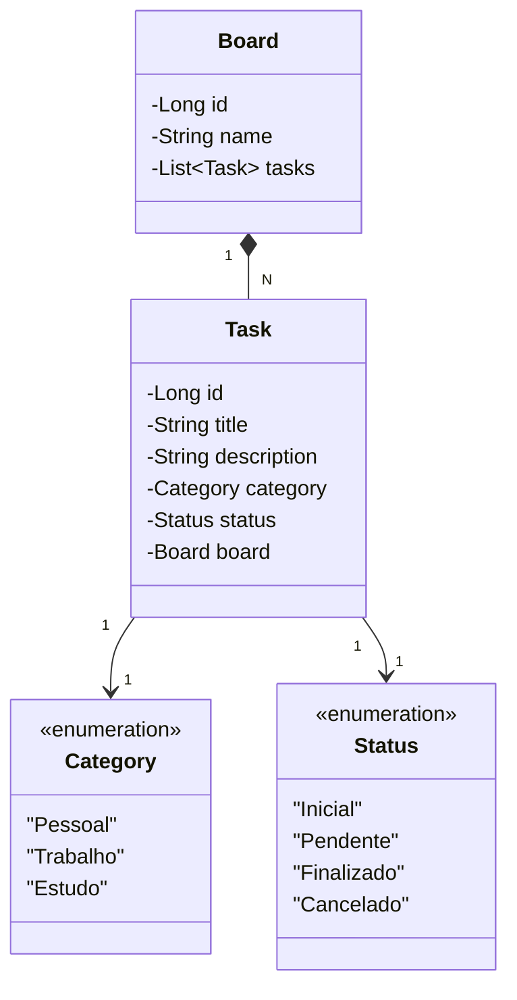

# 🚀 **Criando seu Board de Tarefas com Java**  

## 📌 **Descrição do Projeto**  

O sistema permite que usuários criem **quadros (boards)** para diferentes projetos e gerenciem **tarefas (cards)** dentro deles. Cada tarefa pode ser classificada em uma **categoria** e associada a um **status**, facilitando o acompanhamento do fluxo de trabalho.  

✅ **Funcionalidades principais:**  
✔ Criar e gerenciar **boards** com colunas personalizadas.  
✔ Criar, mover, bloquear e cancelar **cards**.  
✔ CRUD completo para **tarefas**.  
✔ Classificação por **categorias** (Pessoal, Trabalho, Estudo).  
✔ Controle de **status** (Inicial, Pendente, Cancelado, Finalizado).  
✔ **Banco de Dados MySQL** para armazenamento.  
✔ **Liquibase** para controle de versão do banco de dados.  

---

## 🔧 **Tecnologias Utilizadas**  

| Tecnologia            | Descrição |
|-----------------------|-------------------------------------------|
| **Java 21**           | Última versão LTS, com melhorias de desempenho. |
| **Spring Boot 3.2.3** | Framework para desenvolvimento rápido de APIs. |
| **MySQL**             | Banco de dados relacional para armazenamento das tarefas. |
| **Liquibase**         | Versionamento do banco de dados e migrações. |
| **Gradle**            | Gerenciador de dependências e automação de build. |
| **Lombok**            | Redução de código repetitivo com anotações. |

---

## 📂 **1. Estrutura do Projeto**  

O projeto segue **boas práticas de organização**, dividindo **DTOs, serviços, repositórios, entidades e camadas de persistência**.  

```

```bash
board/
│── gradle/wrapper/
│   ├── gradle-wrapper.jar
│   ├── gradle-wrapper.properties
│
│── src/main/java/br/com/dio/
│   ├── dto/
│   │   ├── BoardColumnDTO.java
│   │   ├── BoardColumnInfoDTO.java
│   │   ├── BoardDetailsDTO.java
│   │   ├── CardDetailsDTO.java
│   │
│   ├── exception/
│   │   ├── CardBlockedException.java
│   │   ├── CardFinishedException.java
│   │   ├── EntityNotFoundException.java
│   │
│   ├── persistence/
│   │   ├── config/
│   │   │   ├── ConnectionConfig.java
│   │   ├── converter/
│   │   │   ├── OffsetDateTimeConverter.java
│   │   ├── dao/
│   │   │   ├── BoardDAO.java
│   │   │   ├── CardDAO.java
│   │   │   ├── TaskDAO.java
│   │   ├── entity/
│   │   │   ├── BoardEntity.java
│   │   │   ├── CardEntity.java
│   │   │   ├── TaskEntity.java
│   │   ├── migration/
│   │   │   ├── MigrationStrategy.java
│   │
│   ├── repository/
│   │   ├── BoardRepository.java
│   │   ├── CardRepository.java
│   │   ├── TaskRepository.java
│   │
│   ├── service/
│   │   ├── BoardService.java
│   │   ├── CardService.java
│   │   ├── TaskService.java
│   │
│   ├── controller/
│   │   ├── BoardController.java
│   │   ├── CardController.java
│   │   ├── TaskController.java
│   │
│   ├── ui/
│   │   ├── BoardMenu.java
│   │   ├── MainMenu.java
│   │
│   ├── Main.java
│
│── src/main/resources/
│   ├── db/changelog/migrations/
│   │   ├── db.changelog-task.sql
│   │   ├── db.changelog-master.yml
│   ├── application-dev.yml
│   ├── application-prd.yml
│
│── build.gradle.kts
│── settings.gradle.kts
```

---
---

# 📌 **2. Diagrama de Classes**  

Aqui está o **diagrama de classes atualizado**, refletindo a nova estrutura do projeto: 

A modelagem segue o diagrama abaixo:
## 🖼️ **A modelagem segue o diagrama abaixo:**  

<p align="center">
  
</p>  



---

## 🔥 **3. CRUD de Tarefas - Implementação**  

Agora, implementamos o **CRUD completo** para gerenciar **tarefas dentro de um board**.  

### 📌 **Entidade `TaskEntity.java`**  

```java
package br.com.dio.persistence.entity;

import jakarta.persistence.*;
import lombok.Data;

@Entity
@Data
public class TaskEntity {

    @Id
    @GeneratedValue(strategy = GenerationType.IDENTITY)
    private Long id;

    private String title;
    private String description;

    @Enumerated(EnumType.STRING)
    private Category category;

    @Enumerated(EnumType.STRING)
    private Status status;

    @ManyToOne
    @JoinColumn(name = "board_id")
    private BoardEntity board;
}
```

### 📌 **Repositório `TaskRepository.java`**  

```java
package br.com.dio.repository;

import br.com.dio.persistence.entity.TaskEntity;
import org.springframework.data.jpa.repository.JpaRepository;

public interface TaskRepository extends JpaRepository<TaskEntity, Long> {
}
```

### 📌 **Serviço `TaskService.java`**  

```java
package br.com.dio.service;

import br.com.dio.persistence.entity.TaskEntity;
import br.com.dio.repository.TaskRepository;
import org.springframework.stereotype.Service;

import java.util.List;

@Service
public class TaskService {

    private final TaskRepository taskRepository;

    public TaskService(TaskRepository taskRepository) {
        this.taskRepository = taskRepository;
    }

    public TaskEntity createTask(TaskEntity task) {
        return taskRepository.save(task);
    }

    public List<TaskEntity> getAllTasks() {
        return taskRepository.findAll();
    }

    public void deleteTask(Long id) {
        taskRepository.deleteById(id);
    }
}
```

---

# 🏗 **4. Como Executar o Projeto**  

### 📌 **Passo 1: Configurar o Banco de Dados MySQL**  

1. Instale o **MySQL** e crie um banco de dados:  
```sql
CREATE DATABASE board_tasks;
```

2. **Atualize `application-dev.yml`:**  
```yaml
spring:
  datasource:
    url: jdbc:mysql://localhost:3306/board_tasks
    username: root
    password: senha
  jpa:
    hibernate:
      ddl-auto: update
```

### 📌 **Passo 2: Rodar o Projeto**  

```sh
./gradlew bootRun
```

Ou no Windows:  
```sh
gradlew.bat bootRun
```

✅ **Agora sua API está rodando em `http://localhost:8080`!**  

---

## 🎯 **5. Conclusão**  

✅ **CRUD completo de Tarefas** dentro de um **Board**.  
✅ **Banco MySQL com Liquibase** para versionamento.  
✅ **Java 21 + Spring Boot 3.2.3** para máximo desempenho.  
✅ **Estrutura de classes organizada e modularizada**.  

💬 **Gostou do projeto? Deixe seu comentário e compartilhe suas ideias!** 🚀# Criando-seu-Board_de_Tarefas_com_Java
